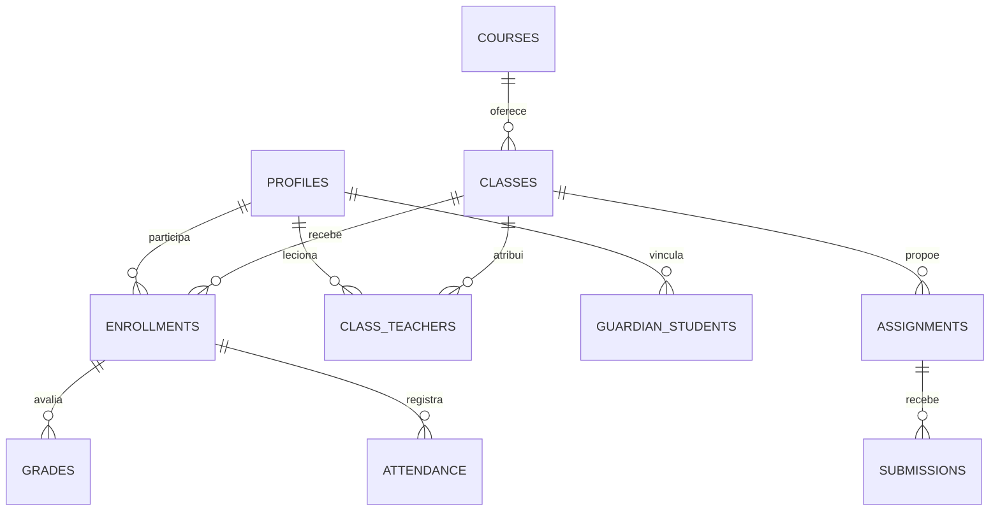

# Arquitetura

Next.js App Router com Server Components; TypeScript estrito; Supabase Auth/PostgreSQL; formulários com validação Zod; Motion; Tailwind e CSS próprio; Vercel.

As páginas institucionais usam layout compartilhado. O catálogo e publicações são consultados com chave pública e RLS. A página inicial mantém destaques editoriais fixos nesta versão.

O portal consulta a sessão no servidor e aplica RLS em todas as operações. Server Actions validam perfil, campos e tipos antes das mutações. Os módulos têm definição explícita de campos e papéis autorizados; não há acesso a nomes de tabelas arbitrários fornecidos pelo usuário.

`private.my_role`, `teaches`, `related`, `in_class` e `sees_student` são helpers internos com search_path fixo, sem exposição por RPC pública, e exigem identidade autenticada. SECURITY DEFINER é usado somente em helpers que evitam recursão de RLS e triggers internos de criação/auditoria. Papéis não são lidos de user_metadata.

A Edge Function `account` usa verificação própria: operações administrativas validam token com Auth e papel ativo no banco; login por RA exige senha validada pelo Auth. A service_role existe somente no ambiente da função.
